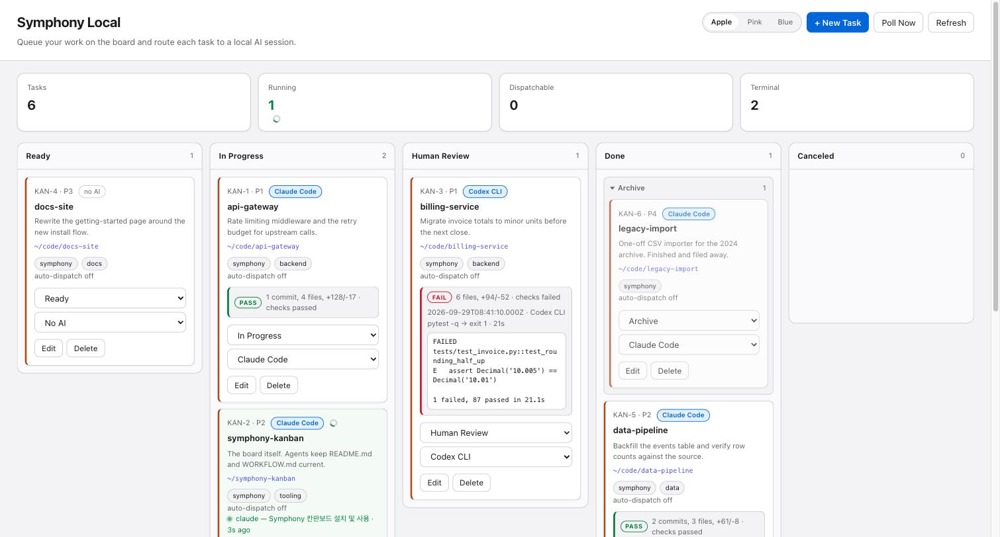
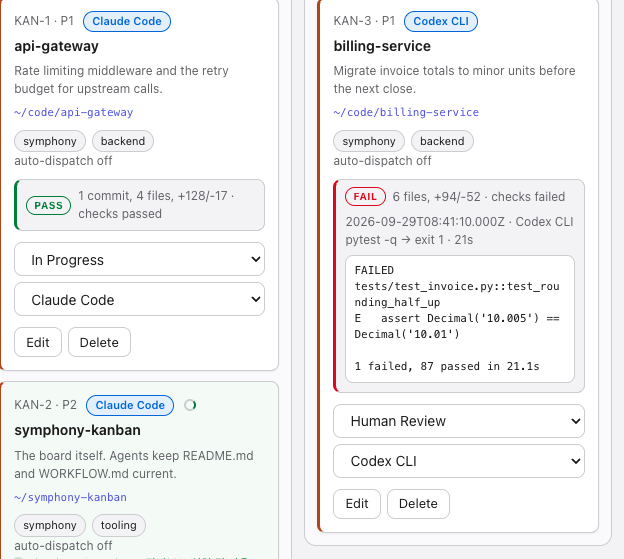
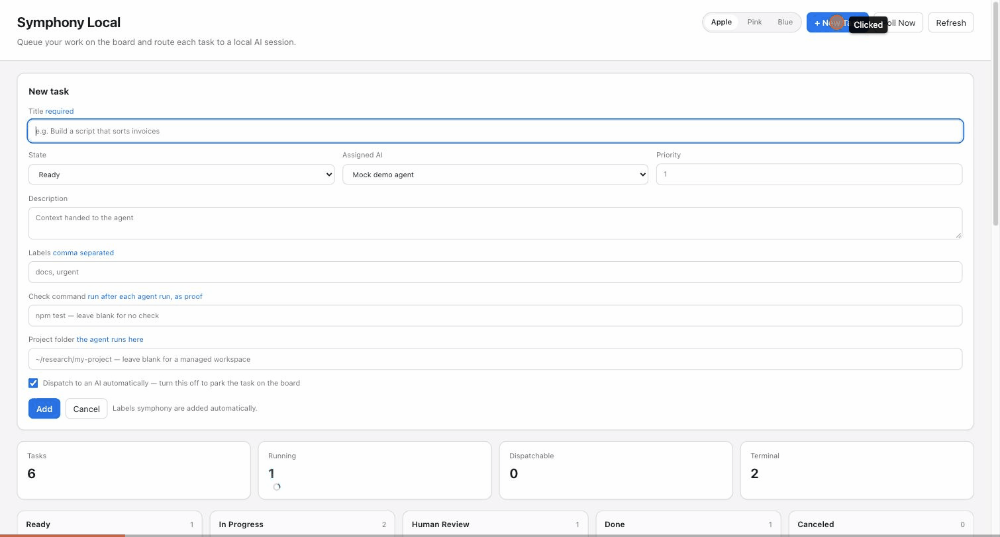

# Symphony Local

A kanban board for the AI sessions running on your own machine.

Each card is a project folder. Whatever is happening in that folder — a session you
started in a terminal, or one Symphony dispatched itself — decides where the card sits,
what the card shows, and when you get told about it.

It is an independent implementation of the [OpenAI Symphony](https://github.com/openai/symphony)
service specification (`SPEC.md` in that repository), not a port of its Elixir reference.
Where it departs from the spec, and why, is at the end of this file.



## What it does

**Runs work.** Polls a tracker, dispatches an agent per task with bounded concurrency,
claims, retries and reconciliation. Each task picks which AI runs it.

**Follows work you run yourself.** Finds `claude`, `codex`, `aider` and `goose` processes,
maps them to the folder they are working in, and reads the CLI's own transcript for what
that session is doing right now.

**Reports honestly.** Every finished run records what it changed and whether the
project's checks still pass. A session waiting on an answer says what it asked.

**Asks for you when it needs you.** Desktop notifications rather than a board you have to
keep looking at.

## Setup

```sh
cp data/issues.example.json data/issues.json
npm start
```

Then open <http://127.0.0.1:8787>. There is nothing to install: it is Node's standard
library and nothing else. Node 20 or newer.

`data/issues.json` holds your real task list and is deliberately not tracked by git — it
contains your folder paths and what you are working on.

## Obsidian

`scripts/vault-sync.js` symlinks every markdown file in a tracked project into an Obsidian
vault under `Projects/<name>/`, and writes a note per project listing them. Symlinks, not
copies: a note opened in the vault is the file in the repository, and an edit either side
is the same edit. Only the markdown is linked — these repositories hold thousands of files
each and Obsidian would otherwise index all of them.

```yaml
vault:
  enabled: true
  path: ~/Documents/Obsidian Vault
```

With that set, a finished run appends a line to its project note under `## Log` — date,
agent, branch, what changed, whether the checks passed. The board's own state is transient;
the note is what accumulates.

Run `node scripts/vault-sync.js` after adding markdown to a repository, since new files do
not appear until the links are rebuilt.

## Parallel work in one repository

A task is a folder, and a git worktree is a folder, so several worktrees of one repository
are several cards of one project — each on its own branch, each with its own session.

```sh
cd ~/research/magnet
git worktree add ../magnet-exp-a -b exp/a
git worktree add ../magnet-review -b review
```

Each worktree gets a card, either by starting a session in it or by adding the card first
and setting its `role`. The board fills in `project` (the repository every worktree shares)
and `branch_name` on each poll, shows both on the card, and the filter in the top bar
narrows the board to one project.

`role` is a free label — `experiment`, `review` — that says what a card is for.

`blocked_by` decides the order. A review task listing the experiments it compares is not
dispatched until each of them reaches a terminal state, which is how a comparison waits for
the runs it compares without anyone watching the clock.

The guards that make this safe are the ones already in place: one worker per folder means
one per worktree, and Symphony will not dispatch into a worktree where a session of yours
is open.

Two things worth knowing before running several at once. Worktrees share one `.git`, so
simultaneous commits can collide on `index.lock`. And N parallel sessions cost N times as
much, which is what the usage rings are for.

## One task per project folder

A task's `workspace_path` names a folder you already work in. The agent for that task
runs with that folder as its working directory, so whichever AI picks it up is looking at
the same files you are.

```json
{
  "title": "my-paper",
  "workspace_path": "~/research/my-paper",
  "agent": "claude",
  "verify_command": "latexmk -pdf main.tex"
}
```

`~` and `$VARS` are expanded, and a relative path resolves against the project root. The
folder must already exist: the API returns 400 rather than creating one, so a typo does
not scatter empty directories.

That folder is yours, not Symphony's. It is never created, never seeded by the
`after_create` hook, and `WorkspaceManager.remove()` refuses to delete it. A task with no
`workspace_path` still gets a managed workspace under `workspace.root` and behaves as the
spec describes.

Keep the `before_run` and `after_run` hooks unset unless you want files written into the
folders your tasks point at. Both run in the task's folder, whichever folder that is.

## The board follows your sessions

The session in a folder is that task's state, so the board follows it rather than being
kept in step by hand:

| What the session is doing | Column |
| --- | --- |
| A turn is running (`stop_reason: tool_use`) | In Progress |
| The turn ended with a question for you | Human Review |
| Open, with nothing pending | Ready |
| Process gone | Done |

Claude records why each turn stopped, which is what separates working from handed-back.
Telling *waiting on an answer* from *idle* is the one judgement call: it reads the last
thing the assistant said and asks whether it ends in a question. That heuristic lives in
`looksLikeAQuestion` in `src/transcripts.js` and is the part most worth tuning.

The watcher owns only those four columns, so a card parked in Archive or Canceled stays
put, and a task Symphony is running itself is left to its own lifecycle. Reaching Done
needs a session to have been seen in that folder and then be gone for `settle_polls`
polls; a transcript on disk counts as having been seen, so a restart does not freeze cards
where they were left.

### Sessions that were only ever left open

A process can sit idle for days. Counting it as live makes the board claim work is
happening when a terminal was simply never closed, so a session quiet for longer than
`sessions.stale_after_hours` stops counting — it no longer holds a card in a column and no
longer blocks dispatch. It is still listed with its idle time so you can see what is worth
closing. Nothing is killed for you.

## Proof of work

The point of a board is to review finished work rather than supervise it being done, and
an agent's own account of itself is not evidence. So every run that finishes records two
things on the card: what it changed inside the folder, and whether the project's own check
still passes.

The card shows one line — `8 files, +162/-9 · checks passed` — with the command, exit
code, duration and the tail of its output underneath. A failing check is recorded as
failed with its output kept, since that is the output most worth reading. A task with no
check command still records its diff and says plainly that no check was configured rather
than implying success.



A task carries its own `verify_command`; `verify.command` is the fallback. Evidence lives
on the issue as `last_run`, so it survives a restart, and
`GET /api/suggest-verify?path=<folder>` proposes a command from what a folder contains
instead of guessing one and running it unasked.

## Answering a question from the board

A card in Human Review shows the whole of what the session asked. Where it is safe to do
so, it also takes an answer:

```sh
curl -X POST localhost:8787/api/issues/local-4/reply \
  -H 'content-type: application/json' -d '{"answer":"go ahead, ship it"}'
```

That resumes the conversation by id — `claude --resume <session>` or
`codex exec resume <session>` — in the task's folder, and records the outcome as
`last_reply`.

Two things are worth knowing.

**It cannot type into your terminal.** Injecting keystrokes into another process's TTY is
blocked by the operating system, and rightly so. Resuming the same conversation in a new
process is a different thing that happens to serve the same purpose.

**Which is why it refuses while your terminal is open.** A new process on a live
conversation means two of them writing over each other. So the card shows the question
either way, but the answer box appears only when nothing is running in that folder —
otherwise it says to answer in the terminal. In practice the box is for runs Symphony
dispatched itself, which leave no terminal behind.

The answer reaches the CLI as an argv entry, never through a shell, so quotes, backticks
and semicolons in what you type stay text.

## Being told instead of looking

A board that reports correctly still only reports to someone looking at it.

```yaml
notify:
  enabled: true
  on: [human_review, check_failed]
  command: null
  after_waiting_ms: 60000
```

macOS notifications by default; set `command` to your own notifier and it receives
`SYMPHONY_NOTIFY_TITLE` and `SYMPHONY_NOTIFY_MESSAGE`. The same card does not nag on every
poll, and `after_waiting_ms` is why your own terminal stays quiet: answer within that
window and nothing is sent, because you were already there.

A browser popup is deliberately not the alerting mechanism — it only works while the board
is open, which is exactly when you do not need it.

## Guards on auto-dispatch

Auto-dispatch lets an agent write with nobody watching, in a folder you already work in.
Three rules apply before a task is dispatched.

**The folder must be under version control.** A git repository with at least one commit,
or the run is refused and the reason logged once. This is a safety net, not a fence:
nothing here stops an agent writing outside the task's folder — a real test run edited
files two directories away — and confining it needs the CLI's own permission
configuration, which differs per CLI. What the guard buys you is that whatever happens
inside the folder can be seen and undone.

**One worker per folder.** `agent.max_concurrent_agents_per_folder`, default 1.

**Never beside a session of yours.** `dispatch_guard.skip_if_session_open` stops Symphony
dispatching into a folder that already has a live session. Both of these prevent the same
failure: two agents editing the same files, each unaware of the other.

## Wiring up a real agent

`agents` in `WORKFLOW.md` maps a name to the shell command that runs it, and a task picks
one. The spec has a single `codex.command`; this is what makes per-task routing possible.

```yaml
agents:
  claude:
    label: Claude Code
    command: |
      set -e
      proj="$HOME/.claude/projects/$(printf '%s' "$PWD" | sed 's|[^A-Za-z0-9-]|-|g')"
      if [ -d "$proj" ]; then
        claude --continue --print "$SYMPHONY_PROMPT"
      else
        claude --print "$SYMPHONY_PROMPT"
      fi
      node "$SYMPHONY_HOME/scripts/finish.js" "Human Review"
agent:
  default_agent: claude
```

Write every command as a `|` block: the front-matter parser strips a trailing quote from
an inline scalar, which would corrupt any command ending in `"`.

A task with no agent falls back to `agent.default_agent`. An unknown name is logged as
`agent_not_found` and also falls back, so a typo never silently skips the work.

Each turn's child process receives:

| Variable | Contents |
| --- | --- |
| `SYMPHONY_PROMPT` | rendered prompt template |
| `SYMPHONY_AGENT` | resolved agent name |
| `SYMPHONY_HOME` | the directory holding `WORKFLOW.md` |
| `SYMPHONY_ISSUE_ID` / `_IDENTIFIER` | tracker ids |
| `SYMPHONY_ISSUE_TITLE` / `_STATE` / `_LABELS` | issue fields, labels comma-separated |
| `SYMPHONY_ATTEMPT` / `_TURN` | retry and turn counters |
| `SYMPHONY_TRACKER_KIND` / `_PATH` | tracker location, for writing results back |

Two things every real agent command needs:

**End by calling `scripts/finish.js`.** The orchestrator dispatches any task that is
active and dispatchable. `scripts/mock-agent.js` sets its own state, so it stops; a real
CLI does not, and the task would be dispatched again on every poll. `finish.js` moves the
task and clears `dispatchable`, which is what actually ends the loop.

**Check permissions before trusting it unattended.** `claude --print` and `codex exec` run
with nobody at the keyboard. Whether they can edit files without a prompt depends on your
own CLI configuration. Run one task and watch before turning auto-dispatch on for a folder
that matters. This project ships no permission-skipping flags.

Timeouts matter here too. The defaults are sized for a real agent — a 15 minute turn and
10 minutes of silence — because `--print` produces no output at all until it finishes.

## Managing tasks

`+ New Task` opens a form for title, description, priority, state, labels, assigned AI,
check command, project folder and auto-dispatch. Each card has `Edit` for inline editing,
a two-step `Delete`, and `Archive` when it is in a terminal state. Required labels from
`tracker.required_labels` are added automatically. While a card is open for editing, the
board pauses its three-second refresh so in-progress input is never overwritten.



Archived cards collapse into a drawer at the top of the Done column, with unarchived Done
cards below it. A card that has sat in Done untouched for `archive.after_days` moves there
on its own.

Three themes — Apple, Pink and Blue — switch from the top bar and are remembered per
browser. Each is a block of custom properties at the top of `public/styles.css`; add a
fourth by copying one and adding its name to `THEMES` in `public/app.js`.

## HTTP API

The board's own endpoints are extensions: the spec's tracker contract is a read kernel and
says nothing about creating or editing tasks.

| Endpoint | Purpose |
| --- | --- |
| `GET /api/config` | states, agents, required labels |
| `GET /api/issues` | the task list |
| `POST /api/issues` | create a task |
| `PATCH /api/issues/<id>` | edit any mutable field |
| `DELETE /api/issues/<id>` | remove a task |
| `POST /api/issues/<id>/reply` | answer the session's question |
| `GET /api/suggest-verify?path=` | propose a check command for a folder |
| `GET /api/logs` | recent structured log entries |

Alongside them, the spec's operator surface:

| Endpoint | Returns |
| --- | --- |
| `GET /api/v1/state` | claims, retries, `codex_totals`, live external sessions |
| `GET /api/v1/<identifier>` | one issue with its claim, failure, sessions and history |
| `POST /api/v1/refresh` | run a poll and reconciliation immediately |

Every error is the spec envelope, `{"error":{"code":"...","message":"..."}}`.

## Reconciliation

Every tick, running issues are checked against the tracker. A card moved to a terminal
state terminates its agent process and clears its managed workspace; a card that stops
being dispatchable, leaves the active states, or disappears terminates without cleanup. A
cancelled run is recorded as `CanceledByReconciliation`, not a failure, so it earns no
retry backoff. A tracker read failure leaves running work alone and retries next tick.

A run attempt reports the spec's phases as it goes — `PreparingWorkspace`,
`BuildingPrompt`, `LaunchingAgentProcess`, `StreamingTurn`, `Finishing` — and ends on
`Succeeded`, `Failed`, `TimedOut`, `Stalled` or `CanceledByReconciliation`. Failure backoff
is the spec's `10000 * 2^(attempt-1)`, capped by `agent.max_retry_backoff_ms`.

Workspaces orphaned by a restart are removed at startup. Folders a task points at with
`workspace_path` are never cleaned: they are yours.

## Configuration

Everything lives in `WORKFLOW.md`'s front matter and is re-read without a restart. The
sections beyond the spec's own:

```yaml
sessions:          # the board follows the session in each folder
  watch: true
  names: [claude, codex, aider, goose]
  settle_polls: 2
  stale_after_hours: 12
  states:
    working: In Progress
    idle: Ready
    waiting: Human Review
    ended: Done
archive:           # Done leaves the column on its own
  enabled: true
  from_state: Done
  to_state: Archive
  after_days: 2
notify:            # say when attention is needed
  enabled: true
  on: [human_review, check_failed]
  command: null
  after_waiting_ms: 60000
reply:             # answer a waiting session from the board
  enabled: true
  timeout_ms: 900000
verify:            # proof of work
  enabled: true
  command: null
  timeout_ms: 300000
dispatch_guard:    # refuse auto-dispatch without an undo
  skip_if_session_open: true
  require_git: true
```

`node src/cli.js validate --workflow WORKFLOW.md` prints the resolved configuration.

## Where this differs from the spec

Three departures are deliberate:

- **No `codex app-server` protocol.** The spec targets a session protocol with thread and
  turn ids, token accounting and tool advertisement. This runs `bash -lc <command>` and
  reads the agent's stdout. That is the trade that buys per-task agent routing, and it
  means the live-session fields are filled from whatever a CLI prints rather than from a
  protocol.
- **`workspace_path` escapes the workspace root.** The spec makes workspace isolation
  mandatory, and pointing a task at a folder you already work in breaks that on purpose.
  Hence the dispatch guard, `remove()` refusing those folders, and the demo hooks that
  wrote into the working directory being deleted.
- **Writes to the tracker.** The spec's adapter is a read kernel; board CRUD extends it.

Also absent: branch-per-task and pull requests. They are how a team hands work to a
reviewer, and they conflict with pointing a task at the folder you are already in.

Still missing from the spec: the continuation retry (a fixed 1000 ms re-queue after a
normal exit) and `codex_rate_limits`, which has no source without the app-server protocol.

## Known limits

- **An agent is not confined to the task's folder.** The dispatch guard makes changes
  recoverable, not impossible. Use your CLI's permission configuration for a real fence.
- Deleting a task frees its id, so the next task created can reuse it, and with it the
  `data/workspaces/<IDENTIFIER>` directory of the deleted task.
- The API has no authentication or CSRF protection. It binds `127.0.0.1` only and assumes
  a single trusted local operator. Conversation text from transcripts is rendered on the
  board.
- Session detection matches CLI names. Using a different tool means adding its name to
  `sessions.names`, and its transcript format to `src/transcripts.js` for live detail.

## Commands

```sh
npm start                                          # serve the board on 8787
node src/cli.js start --workflow WORKFLOW.md --port 8787
node src/cli.js validate --workflow WORKFLOW.md    # resolve and check the config
node src/cli.js once --workflow WORKFLOW.md        # one poll, no server
npm test                                           # no dependencies
```

## Trust and safety

This is built for a trusted personal machine. `WORKFLOW.md` hooks and agent commands are
trusted local code, and tracker secret environment variables declared by an adapter are
removed from the agent's child environment.

The spec's filesystem invariants hold for managed workspaces: names are sanitized, paths
stay under `workspace.root`, and hook timeouts are enforced. They do **not** hold for a
task with a `workspace_path` — that is the point of the field, and the dispatch guard
exists because of it. Keep those folders under version control, and configure your CLI's
own approval and sandbox settings before letting anything run unattended.

## License

MIT. See [LICENSE](LICENSE).
